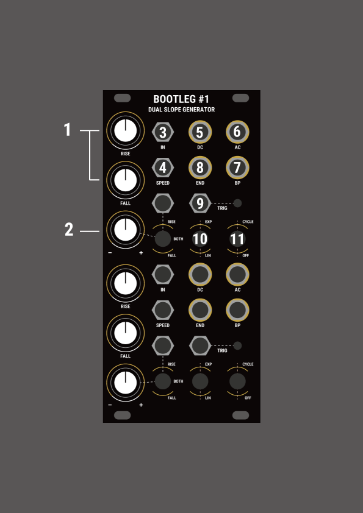

# Bootleg #1 Dual Slope Generator　
Bootleg #1 is a 2-channel envelope generator, envelope follower, and slew limiter.  
Inspired by Serge's DSG, it is constructed with LM3900-style full analog circuitry.

## Specifications
Width: 12HP  
Max Depth (incl. power cable): 32mm  
Maximum current draw:
- 62mA @+12V
- 5mA @-12V

## Features
### Generate three types of envelopes.
- 0-5v Envelope (DC out)
- -2.5v~ 2.5v Envelope(AC out)
- Inverted AC out(BP out)  

The width of the output voltage can be changed by trim on the PCB. (4V~8V)
### Apply Slew or Portamento to control voltages
When a CV is input to the "In" input, it changes to that voltage over the time set by rise and fall knobs.
### EXP-Linear-Log Curve
By turning on the EXP switch, it is connected internally and can output various curves.  
You can change the curve for Rise only, Fall only, or both.
### Various CV modulations
There is a Speed input that controls "Rise" and "Fall" simultaneously, and an input that allows you to select the modulation target with a switch.

## Links
<a href = "https://www.modulargrid.net/e/other-unknown-bootleg-1-dual-slope-generator">Modulargrid</a>

## Manual

### Controls & Connections
1. RISE And FALL Knobs  
   Adjusts the rise and fall of the outputs. CCW rotatin decreases time.  
   The range is 0.001Hz to 10Hz.
2. CV Controls  
   
3. Signal input  
   Slew/ASR/Lag etc. input.  
   Supports 0-5v input.
4. Speed Control  
   CV input to control Rise and Fall time simultaneously.  
   Supports 0-5v input.
5. DC Output  
   Outputs a 0-5V signal.
6. AC Output  
   Outputs a ±2.5V signal.
7. BP Output  
   Outputs an inverted AC signal.
8. END Output  
    Outputs a high gate while the output is Rise and while the envelope is waiting.
9. Trigger Input  
    When a gate signal (5V or higher) enters this jack, the envelope is output once.  
    Triggers are disabled while output is Rise.
10. Exponetial - Linear Switch  
    Switches between Exponential and Linear envelopes.  
    When the switch is in the EXP side, the CV attenuator changes to an exponential curve when turned CCW and to a log curve when CW.
11. Cycle Switch  
    Turn on the Envelope loop.

## Adjust Output Voltage / Speed Control
The CV control of Speed can be adjusted by the variable resistor marked V/OCT on the rear panel with a + driver or similar.  
*Accurate V/OCT tracking is not possible.

The output voltage can be adjusted with the variable resistor on the side not labeled V/OCT.  
If the variable resistor is turned too far, the envelope will not be output, in which case, return the variable resistor and turn on the trigger or Cycle again to adjust the output voltage.

## Notes
This module may have some scuffs and scratches due to the nature of the panel using PCBs.