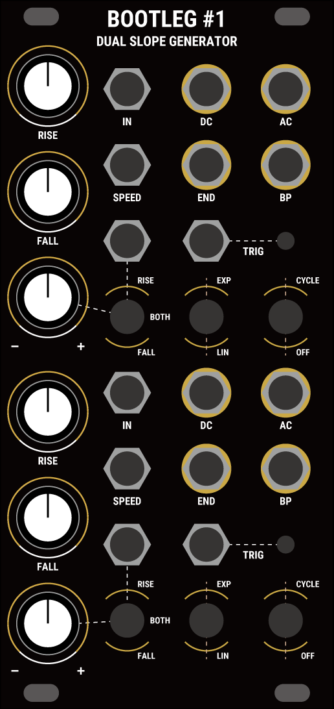
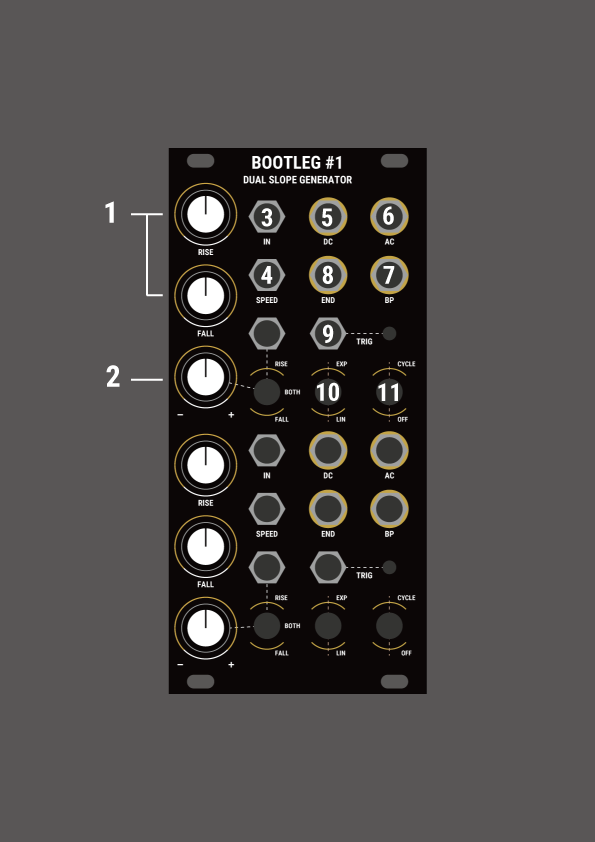

# Bootleg #1 Dual Slope Generator　
Bootleg #1は2chのエンベロープジェネレータ、エンベロープフォロワー、スリューリミッターです。  
SergeのDSGにインスパイアされ、LM3900を使用した完全なアナログ回路で構成されています。

  

## Specifications
Width: 12HP  
Max Depth (incl. power cable): 32mm  
Maximum current draw:
- 62mA @+12V
- 5mA @-12V

## Features
### Generate three types of envelopes.
- 0-5v Envelope (DC out)
- -2.5v~ 2.5v Envelope(AC out)
- AC出力の反転エンベロープ(BP out)  

最大出力電圧は4~8vに調整可能です。裏面のトリムで調整します(後述)。
### Apply Slew or Portamento to control voltages
INジャックにCVを入力する事で、スリューリミッターとして使用でき、入力された電圧にRiseとFallノブで設定された時間をかけて移行します。
### EXP-Linear-Log Curve
EXPスイッチをオンにする事で、指数-直線-対数のカーブへ変化させる事ができます。変化の幅は+-ノブで決定されます。モジュレーション選択スイッチでRiseだけ、Fallだけ、両方と切り替えることもできます。
### Various CV modulations
モジュレーション選択スイッチを経由するCVインプットと、常にRiseとFallに影響を与えるSpeed
インプットの2系統搭載しています。

## Links
<a href = "https://www.modulargrid.net/e/other-unknown-bootleg-1-dual-slope-generator">Modulargrid</a>

## Manual

### Controls & Connections
1. RISE / FALL Knobs  
   RiseとFallの時間を調整します。時計回り方向に時間が長くなっていきます。
   後述のCV入力と合わせて最大20分以上~約5kHzまで可変可能です。
2. CV Controls  
   点線で繋がっているノブ、ジャック、スイッチの組み合わせでエンベロープを調整します。
   10のスイッチがLINの場合、ジャックに入力されたCVのモジュレーション先をRISE-BOTH-FALLスイッチで決定し、±ノブで変化の方向と量を調整します。
   10のスイッチがEXPの場合は、入力されたCV信号と内部出力が合わさった信号によってモジュレーションが行われます。
3. Signal input  
   Slew/ASR/Lagなど様々な用途で使えるインプットです。  
   0v-5vの入力に対応しています。
4. Speed Control  
   RiseとFallの時間を同時に調整します。  
   0v-5vの入力に対応しています。
5. DC Output  
   Outputs a 0-5V signal.
6. AC Output  
   Outputs a ±2.5V signal.
7. BP Output  
   AC出力を反転した±2.5Vの信号が出力されます。
8. END Output  
   エンベロープがオフもしくはRiseの間HIGHになるゲートを出力します。
9. Trigger Input  
   エンベロープのトリガー信号の入力です。
   出力がRiseの間のトリガーは無効になります。
10. Exponetial - Linear Switch  
   指数-直線-対数の切り替えスイッチです。EXP側にすると、DC信号が内部的にモジュレーションCVインプットに結線され、エンベロープのカーブが変化します。
   ±ノブが反時計回り方向で指数的、時計回りで対数的に変化します。
11. Cycle Switch  
   エンベロープのループのオンオフを切り替えます。

## Adjust Output Voltage / Speed Control
背面のV/OCTと書いてある可変抵抗を+ドライバーなどで調整することで、SpeedのCVコントロールを調整する事ができます。  
*正確なV/OCTのトラッキングはできません。

V/OCTと書かれていない方の可変抵抗で出力電圧を変化させる事ができます。  
大きく回しすぎると、エンベロープが出力されなくなるので、その際は可変抵抗を戻して再度トリガーもしくはCycleをオンにして調整してください。

## Notes
このモジュールはPCBを使用したパネルの特質上、擦れや傷がある場合がございます。